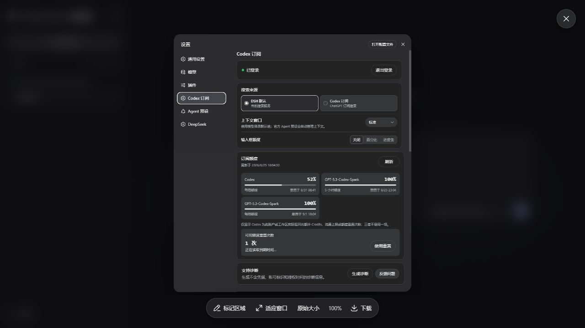
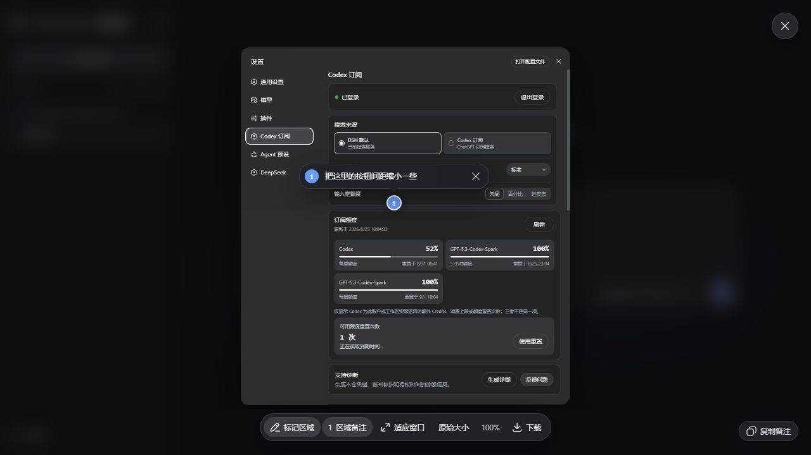

# DSH Native Image Viewer

A compact, provider-neutral image viewer for DeepSeek Harness. It upgrades images already shown by DSH without replacing the conversation, attachment, or model workflows.

> Beta: the viewer targets the latest public DSH release. Unsupported image markup is left untouched instead of being guessed.

<p align="center">
  
</p>

<p align="center">
  
</p>

## Features

- Wheel zoom centered on the pointer, drag-to-pan, touch pinch, and double-click 100% view.
- Fit and original-size controls, original-file download, keyboard navigation, and multi-image galleries.
- One-shot region marking with each note edited beside its numbered image marker.
- Light and dark themes through DSH design tokens, responsive layout, focus containment, and reduced-motion support.
- Optional `nativeImageViewer` client service so image-producing plugins can add their own continuation action.

DSH keeps working when the plugin is absent or cannot recognize a newer image surface. Other plugins may use the service when present, but must retain their own basic fallback.

## Install

Install the Beta:

```powershell
irm 'https://github.com/WSL043/dsh-native-image-viewer/releases/latest/download/install.ps1' | iex
```

Or use the official DSH command:

```sh
dsh plugin --profile web add dsh-native-image-viewer@0.1.0-beta.1
```

Restart DSH manually after saving active work. The installer never needs access to provider credentials or image-generation accounts.

## Update

Run the same `add` command with the version you want to install.

## Uninstall

```sh
dsh plugin --profile web remove dsh-native-image-viewer
```

Uninstalling restores DSH's built-in image lightbox. It does not remove conversations, attachments, generated images, provider plugins, or credentials.

## Privacy

Image bytes stay in the current browser profile. The plugin reads only URLs already rendered by DSH, does not upload images, does not call a model, and does not read provider credentials. Region notes remain transient unless another plugin explicitly uses them for a user-requested action.

## Support

Open an issue with the exact plugin version, DSH version, operating system, image location (message or composer), and the action that failed. Do not include private images, credentials, or full session logs.

## License

MIT
